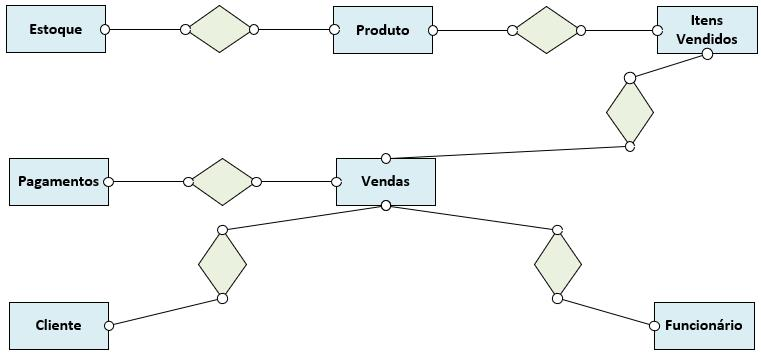
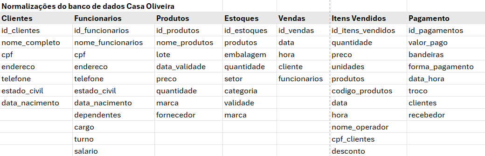
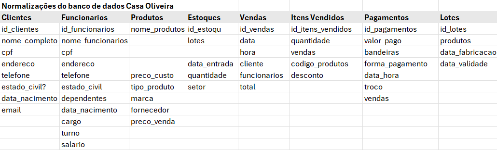
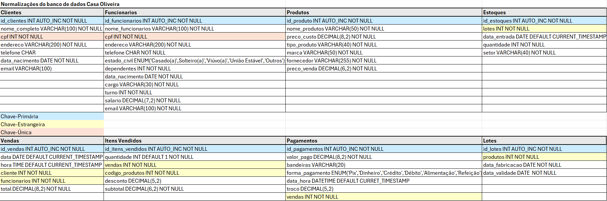
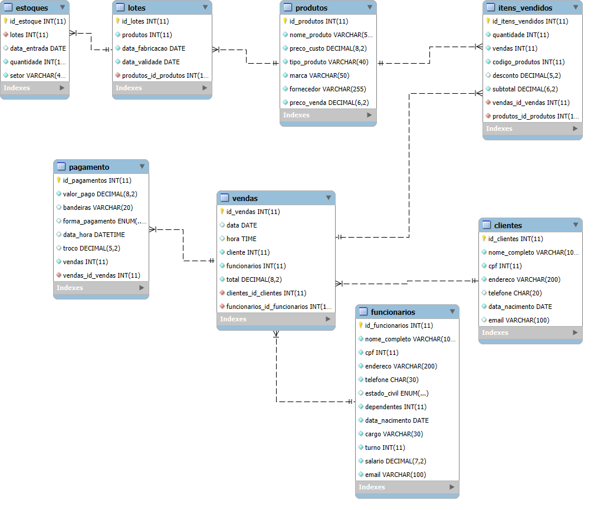

# Estudo de caso: Casa Oliveira
 
 
### Itens lemantados
* Estoques
* Funcionários
* Vendas
* Itens Vendidos
* Pagamentos
* Clientes
* Produtos
 
## Modelo Conceitual
 

 
## Normalização do banco de dados Casa Olivaira
 
### Primeira Normalização

 
### Segunda Normalização

 
### Quarta Normalização
 

### Modelo conceitual MER

## modelo fisico de bando de dados 
### script que gera o banco de dados
#### formato SQL - structure query language

    ---sql
    -- Comando para criar banco de dados. Ultilizaremos o comando CREAT DATABASE
    CREATE DATABASE casaoliveira;
    -- O comando USE, seliciona o banco que deseja trabalhar
    USE casaoliveira;
    ---

    ---sql
    - Criação da tabela Clientes

    CREATE TABLE Clientes(
    id_clientes int auto_increment primary key not null,
    nome_completo varchar(100) not null,
    cpf int unique not null,
    endereco varchar(200) not null,
    telefone char(20),
    data_nacimento date not null,
    email varchar(100)
    );
 
    CREATE TABLE Funcionarios(
    id_funcionarios int auto_increment primary key not null,
    nome_completo varchar(100) not null,
    cpf int unique not null,
    endereco varchar(200) not null,
    telefone char(30) not null,
    estado_civil enum('Casado(a)','Solteiro(a)','Viúvo(a)','União Estável','Outros'),
    dependentes int not null,
    data_nacimento date not null,
    cargo varchar(30) not null,
    turno int not null,
    salario decimal(7,2) not null,
    email varchar(100) not null
    );
 
    CREATE TABLE Produtos(
    id_produtos int auto_increment primary key not null,
    nome_produto varchar(50) not null,
    preco_custo decimal(8,2) not null,
    tipo_produto varchar(40) not null,
    marca varchar(50) not null,
    fornecedor varchar(255) not null,
    preco_venda decimal(6,2) not null
    );
    
    CREATE TABLE Estoques(
    id_estoque int auto_increment primary key not null,
    lotes int not null,
    data_entrada date default current_timestamp,
    quantidade int not null,
    setor varchar(40) not null
    );
    
    Create table vendas(
    id_vendas INT AUTO_increment primary key NOT null,
    data DATE DEFAULT CURRENT_TIMESTAMP,
    hora TIME DEFAULT CURRENT_TIMESTAMP,
    cliente INT NOT NULL,
    funcionarios INT NOT NULL,
    total DECIMAL(8,2) NOT Null
    );
    
    create table itens_vendidos(
    id_itens_vendidos INT AUTO_increment primary key NOT NULL,
    quantidade INT DEFAULT 1 NOT NULL,
    vendas INT NOT NULL,
    codigo_produtos INT NOT NULL,
    desconto DECIMAL(5,2),
    subtotal DECIMAL(6,2) NOT NULL
    );
    
    create table pagamento( 
    id_pagamentos INT AUTO_increment primary key NOT NULL,
    valor_pago DECIMAL(8,2) NOT NULL,
    bandeiras VARCHAR(20),
    forma_pagamento ENUM('Pix','Dinheiro','Crédito','Débito','Alimentação','Refeição'),
    data_hora DATETIME DEFAULT CURRENT_TIMESTAMP,
    troco DECIMAL(5,2),
    vendas INT NOT NULL
    );
    
    create table lotes(
    id_lotes INT AUTO_increment primary key NOT NULL,
    produtos INT NOT NULL,
    data_fabricacao DATE NOT NULL,
    data_validade DATE  NOT NULL
    );

    